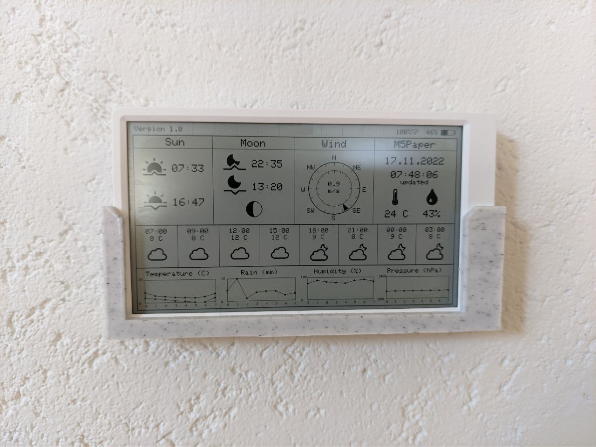

## M5PaperWeather
  **M5Paper project with weather information from openweathermap ***

   

### Description
  Arduino project to show internal environment data and weather information from 
  openweathermap https://openweathermap.org on the e-ink display of the M5Paper.  
  Please edit the config.h file with your own data.  
  You need an api key from openweathermap.  
  As of the new API version 3.x.x, an account with a credit card on file is mandatory, but 1000 requests per day are free.  
  Do not forget to set a limit of 1000 requests in the account.   
  Set the longitude and latitude of your location and your api key and then check if you get answer within your browser.  
  http://api.openweathermap.org/data/3.0/onecall?lat=61.496052&lon=23.7798&units=metric&lang=en&exclude=minutely&appid=your api 3.0.0 key ***  
  
  The software shows the following information:
  * A header with version, city wifi strength and battery status
  * Sun section with sunrise and sunset 
  * Moon section with moonrise and moonset
  * Wind section with wind direction and wind speed
  * The internal SH30 sensor data (temperature and humidity) with the current date and time
  * A hourly forecast with hour, temperature and a weather icon.
  * Some detailt forecast graphs with temperature, rain, humidity and pressure

### Wall mount  
   See https://www.thingiverse.com/thing:4767014
   

### Disclaimer
   I don't take any responsibility nor liability for using this software nor for the 
   installation or any tips, advice, videos, etc. given by any member of this site or any related site.

### License
   This program is licensed under GPL-3.0

### Thanks
   * https://www.arduino.cc
     *Thanks to the Arduino community with all its incredible possibilities and support.** 
   * Special thanks for the drawing function of the moon and the wind section from David Bird
     https://github.com/G6EJD/ESP32-Revised-Weather-Display-42-E-Paper
